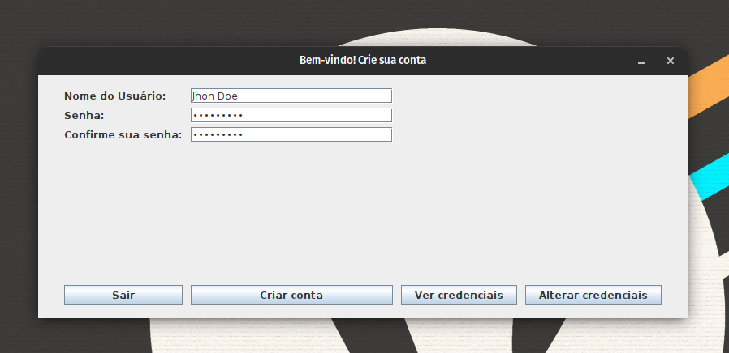

<h1 align="center">📚 Aplicação utilizando JFrame - Programação Orientada a Objetos II</h1>

> Atividade aplicada pelo professor Adriano Maia.

## 📢 Sobre a Questão

Devemos criar um programa utilizando a biblioteca JFrame que será responsável por gerenciar logins.
em um determinado sistema. Onde um funcionário terá total acesso ao sistema, para criar contas, alterar ou 
buscar um usuário.

A aplicação deverá ser construída em Java, utilizando a biblioteca JFrame e as ações devem ser em runtime.

### 📋 Critérios avaliados

1. Campos que foram definidos no slide devem ser obrigatórios;
2. O funcionário deve conseguir cadastrar, alterar e pesquisar um usuário;
3. Código precisa ser autoral e se possível validações;

## 🎯 Ferramentas utilizadas no desenvolvimento da aplicação:

- `Java 18`
- `openjdk-18-jre`
- `openjdk-18-jdk`
- `IntelliJ IDEA`
- `GIT`

## 📚 Oque está sendo entregue

Nessa aplicação o funcionário vai conseguir ter algumas funcionalidas do CRUD de um usuário.
Além disso, as classes possuem validação e tratamento de exceções, para que o usuário não possa fazer algo que não deveria.
Para melhor escalabilidade da aplicação, foi utilizado o padrão de projeto `SOLID`,
onde cada classe é responsável por uma única funcionalidade e nada mais que isso.

Para uma comprovação de um código funcinal, foi utilizado do [GitHubActions](https://github.com/features/actions) 
responsável por ci/cd,
que testará o código e verificará se funciona corretamente em cada `push` e `pull-request` feita no repo.

Para gerar um arquivo executável foi utilizado um script que gerava um `.jar` a cada versão da aplicação.

## 🦥 Futuras atualizações

Na aplicação, pode-se encontrar alguns _TODOS_ que vão ser implementados como forma externa a avaliação, com
o intuito de melhorar a qualidade do código.

- `Adaptação da classe UTILS`: Será removido algumas lógicas repetitivas para um Utils, onde todo o contexto
  poderá utilizar.
- `Reescrita de algumas regras de négocio`: Será reescrita algumas regras de négocio para melhorar o desempenho da 
  aplicação.
- `Adição de um banco de dados`: Será adicionado um banco de dados para armazenar os utilizadores e não mais em runtime.

## 🚀 Releases

Cada release foi gerada por uma `Command Line Interface` (CLI) chamada [GitHub CLI](https://cli.github.com/).
As releases são categorizadas por versão da aplicação, onde cada uma possui um nome e um arquivo executável.

Caso queira uma release mais recente ou especifica, basta [clicar aqui](https://github.com/deverebor/jframe-user-registration/releases/).

---

  Developer with ❤️‍🔥 by Lucas Souza (@deverebor)

